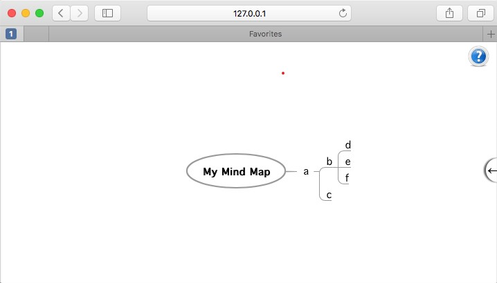

My Mind, collaborative edition
===============================

My Mind is a web application for creating and managing mind maps. It is free to use and you can fork its source code. It is distributed under the terms of the MIT license. This platform extend the original project (http://my-mind.github.io/).

* Get started : https://github.com/lucienhetu/my-mind/wiki
* Documentation : We are not there yet. There is a bit of info [here](http://web.archive.org/web/20170926222132/http://horizon.io/docs/) and [there](https://www.pluralsight.com/guides/building-a-real-time-application-with-react-react-router-horizon-io-and-oauth) over the web
* News / Changelog : https://github.com/lucienhetu/Collaborative-Mind-Mapping/blob/master/Version%20info
* Found a bug or have a feature request? [Open an issue.](https://github.com/lucienhetu/my-mind/issues)
* Have an improvement? [Submit a pull request.](https://github.com/lucienhetu/my-mind/pulls)

OUR GOAL
* Extend the original project to create a workspace where users create a profile and once they are members of a community, they can submit ideas, comment and vote on other ideas, and the most popular ideas are prioritized at the top based on the number of votes the idea receives. Once a promising idea has been identified, ... The team can add more information to the idea, refine it, propose it to leadership and the best ones are selected using sophisticated decision matrix capabilities
* Find external help : Participatory Culture Foundation (Asana)...
 
TODO LIST
* Store data in a local database
  - [X] Integrate web app with RethinkDB
* Realtime collaboration capabilities
  - [x] Modifications to nodes, aka the contributions, are replicate to user in real-time
    - [X] Push changes to clients
      - [x] Integrate Horizon 
    - [x] Integrate pushed changes
* Users mgmt
  - Onboarding
    - Adhesion  
      - [x] Create the forms for adhesion
      - [x] Username
  - Authentication
    - [x] Support majors authentication providers (OpenAuth, Facebook, Google, ...)
  - Preference
    - [x] Remember open nodes
      - [x] Save state
      - [x] Load state on initial page loading
* Contribution mgmt
  - [x] Concurrency mgmt
  - [x] Integrate ID into nodes authorship (for internal reference)
  - [ ] Node stages (draft, from draft to accepted, challenge accepted, ACL, Branching)
* Improve
  - [ ] Clean code
    - [ ] Remove elements not used
    - [ ] Rewrite what was quicly written
  - [x] Ajust permissions (.anyWrite()) and indexes under schema.toml
  - [x] Upgrade to rethinkdb 2.4.0
  - [ ] Evaluate if JIT node loading improve performance
  

